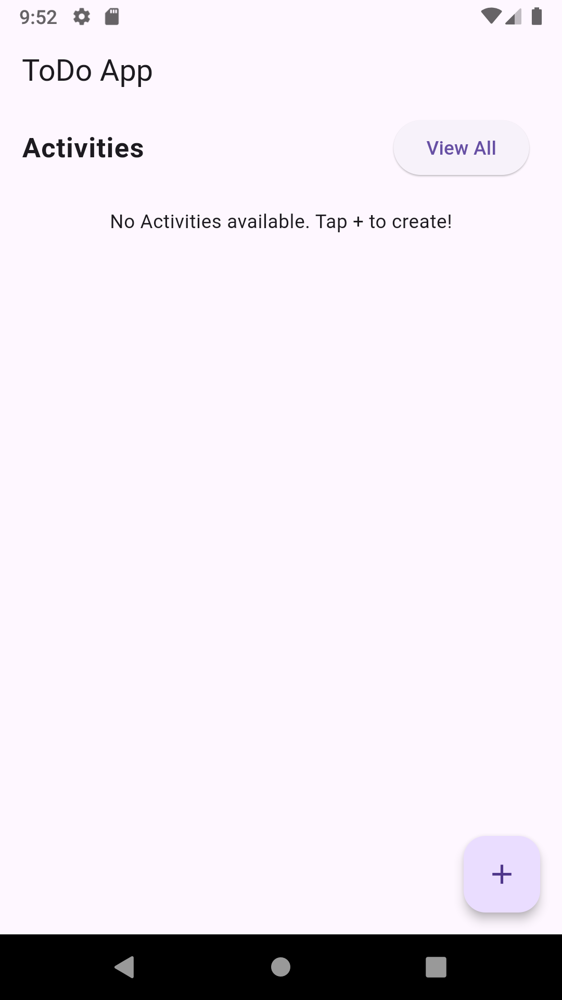
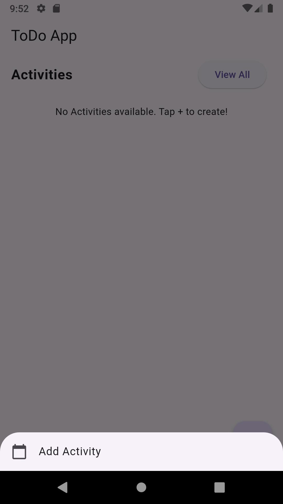
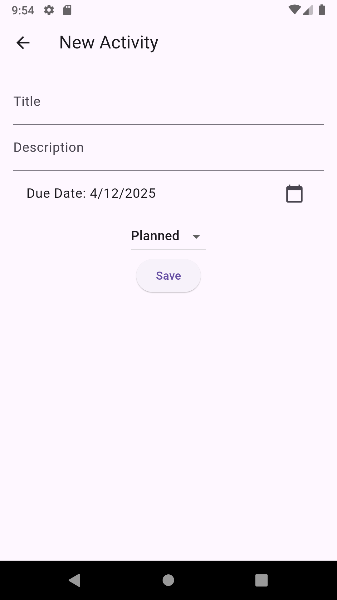
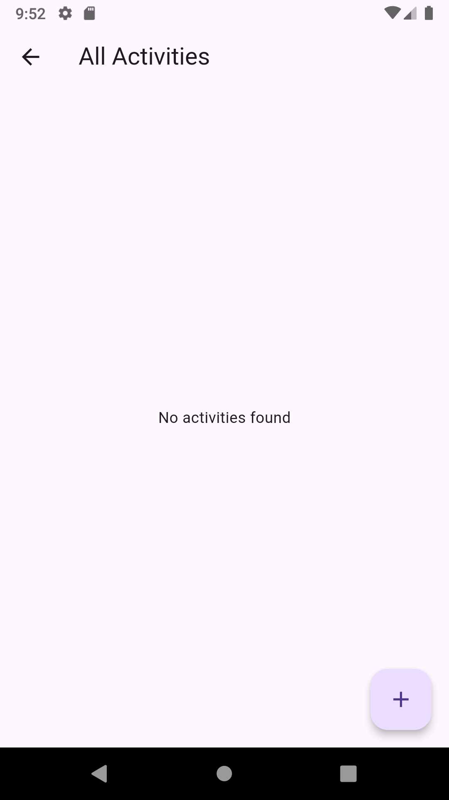
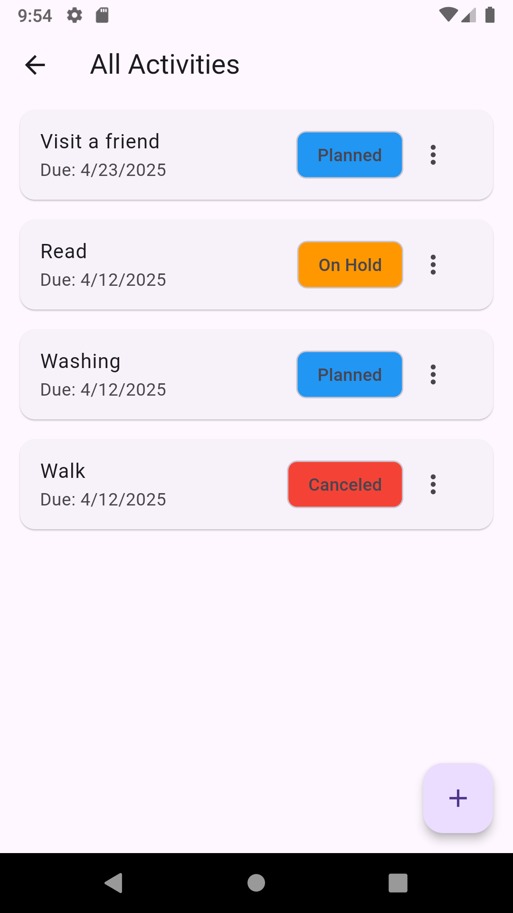

# todo_app

A simple and efficient task management app built with Flutter.
Stay organized by creating, editing, and tracking your daily activities in a clean and intuitive interface.

---

📸 App Screenshots
🏠 Home Screen
A simple dashboard to access and manage all your activities.

  

➕ Add Activity
Quickly create a new note with just a tap.

  

✍️ Create Activity Screen
Write your thoughts or tasks with a smooth, focused writing interface.

  

📭 All Activities Screen (Empty State)
When no activities are added — clean and minimal.

  

📋 All Activities Screen (With Activities)
Browse your saved activities in a structured view.

  

